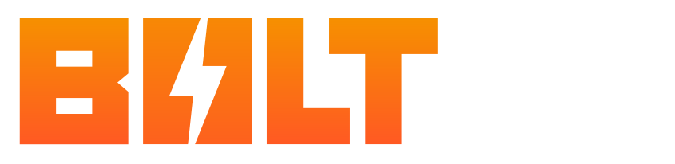
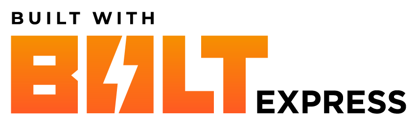
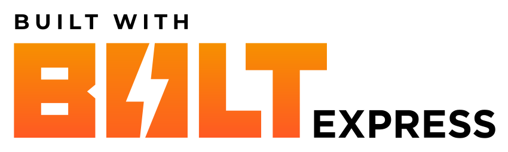
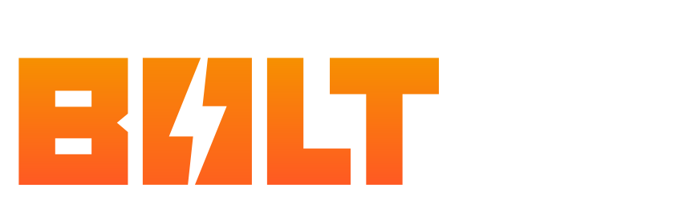

A lightning-fast boilerplate for building Express Addons in Svelte, React, or Vue built on Vite + TypeScript + Sass


[](https://github.com/hyperbrew/bolt-express/blob/master/LICENSE)
[](https://discord.gg/PC3EvvuRbc)

## Features

- Lightning Fast Hot Reloading on changes
- Setup with TypeScript Definitions for Express in Frontend, Backend, and Manifest
- Optimized Build Size
- Easy Smart Bundling in Frontend UI and Backend Code contexts
- Spin a up a new project in Svete, React, or Vue
- Easily configure in express.config.ts
- Easy Package to Zip archive with sidecar assets
- GitHub Actions ready-to-go for Zip Releases

## Backers

Huge thanks to our backers who have made this project possible!

### Founding Backers

_Founding backers have made substantial contribution to the project at the start which has made this project possible._

<a href="https://developer.adobe.com/fund-for-design/" target="_blank">
</a>

...

If you're interested in supporting this open-source project, please [contact the Hyper Brew team](https://hyperbrew.co/contact/).

## Support

### Free Support

If you have questions with getting started using Bolt Express, feel free to ask and discuss in our free Discord community [Discord Community](https://discord.gg/PC3EvvuRbc).

### Paid Support

If your team is interested in paid consulting or development with Bolt Express, please [contact the Hyper Brew team](https://hyperbrew.co/contact/). More info on our [Custom Addon Development & Consulting Services](https://hyperbrew.co/landings/boost-development)

## Can I use Bolt Express in my free or commercial project?

Yes! Bolt Express is **100% free and open source**, being released under the MIT license with no attribution required. This means you are free to use it in your free or commercial projects.

We would greatly appreciate it if you could provide a link back to this tool's info page in your product's site or about page:

Bolt Express Info Page Link: https://hyperbrew.co/resources/bolt-express

**Built with Bolt Express** button graphics:

**PNG Files**

<div style="display:flex;gap:1rem;">
<a href="./src/assets/built-with-bolt-express/Built_With_BOLT_Express_Logo_White_V01.png" target="_blank">
</a>

<a href="./src/assets/built-with-bolt-express/Built_With_BOLT_Express_Logo_Black_V01.png" target="_blank">
</a>

</div>

**SVG Files**

<div style="display:flex;gap:1rem;">
<a href="src/assets/built-with-bolt-express/Built_With_BOLT_Express_Logo_White_V01.svg" target="_blank">
</a>

<a href="src/assets/built-with-bolt-express/Built_With_BOLT_Express_Logo_Black_V01.svg" target="_blank">
</a>

</div>

## Prerequisites

- [Node.js 18](https://nodejs.org/en/) or later
- Package manager either
  - NPM (comes with Node.js)
  - [Yarn](https://classic.yarnpkg.com/lang/en/docs/install/) ( ensure by running `yarn set version classic` )
  - [PNPM](https://pnpm.io/installation) ( ensure by running `pnpm --version` )
- Express Desktop App

## Quick Start

Create your new Bolt Express project (follow CLI prompts)

- yarn - `yarn create bolt-express`
- npm - `npx create-bolt-express`
- pnpm - `pnpm create-bolt-express`

Change directory to the new project

- `cd project`

Install Dependencies (if not already done by create command)

- yarn - `yarn`
- npm - `npm i`
- pnpm - `pnpm i`

Build the addon (must run before `dev`, can also run after for panel to work statically without the process)

- yarn `yarn build`
- npm `npm run build`
- pnpm `pnpm build`

Run the addon in hot reload mode for development

_Note: Ensure "Hot reload addon" is checked in Express Addon Development menu_

- yarn `yarn dev`
- npm `npm run dev`
- pnpm `pnpm dev`

Bundles your addon and specified assets from `copyZipAssets` to a zip archive in the `./zip` folder

- yarn `yarn zip`
- npm `npm run zip`
- pnpm `pnpm zip`

Write frontend UI code in `src/main.svelte` / `src/main.tsx` / `src/main.vue`

Write backend express code in `src-code/code.ts`

### Add Addon to Express

1. Open Express
2. Open Document
3. Select Add-ons from left sidebar
4. Select "Your add-ons"
5. Toggle "Add-on testing"
6. With correct serve port number, check "I Understand..." and press "Connect"

### Load and Debug Addon

1. Launch your addon by clicking on the icon of your Addon in the "In Development" section of "Your Add-ons"
2. Open the Dev Tools by right click > Inspect

---

## Sending Messages between the Frontend and Backend

Bolt Express makes messaging between the frontend UI and backend code layers simple and type-safe.

Simply write your functions in `code.ts` on the backend, and import the `sandbox` variable to call the sandbox functions from the frontend with full type-safety:

### 1. Write Function in Backend src-code/code.ts

```ts
const sandboxApi = {
  myFunction: (a: string, b: number) => {
    // do stuff
    return true;
  },
};
```

### 2. Call that Function from the Frontend

**Frontend:** `src/main.svelte` / `src/main.tsx` / `src/main.vue`

```ts
import { sandbox } from "./utils/utils";

const helloWorld = async () => {
  let result = await sandbox.myFunction("hello", 400);
  console.log(result);
};
```

---

### Info on Build Process

Frontend code is built to the `.tmp` directory temporarily and then copied to the `dist` folder for final. This is done to run the build process outside of the @adobe/ccweb-add-on-scripts process to improve speed in development.

The backend code is bundled into a single `code.js` file.

The `manifest.json` is generated from the `express.config.ts` file with type-safety. This is configured when running `yarn create bolt-express`, but you can make additional modifications to the `express.config.ts` file after initialization.
